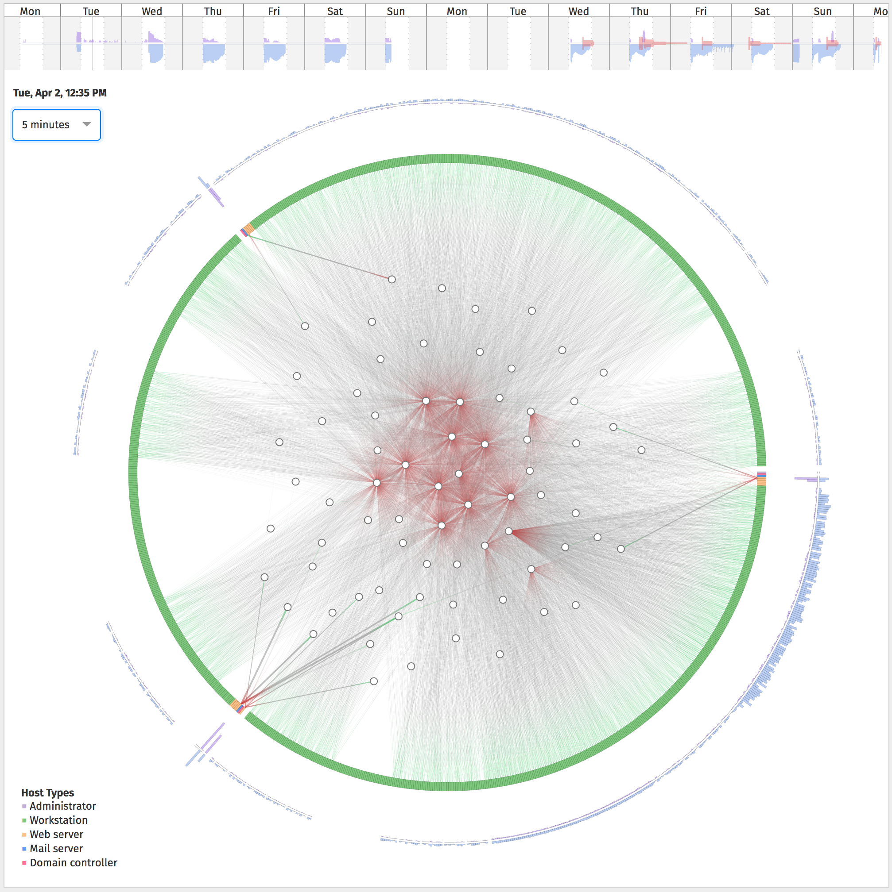

# VizSec Semester Project for CMSC 636 / Data Visualization

## Overview

[Live demo site](http://maiholz.org)



## Getting Started

### Prerequisites

  - [Node.js](https://nodejs.org/en/)
  - [PostgreSQL](https://www.postgresql.org)
  - [PostgREST](http://postgrest.com/)
  - [Yarn](https://yarnpkg.com/)

### Setup

**NOTE:** Downloading and populating the database may take up to 2 hours and requires 30GB of disk space.

#### Clone Repository

```
git clone git@github.com:esturcke/cmsc-636-project.git
```

#### Install Node.js Dependencies

```
yarn
```

#### Download VAST Data

To download and extract the raw VAST data to `raw-vast-data` run:

```
bin/fetch-vast-data
```

#### Process Data and Populate PostgreSQL

Create database `cmsc-636`

```sql
CREATE DATABASE "cmsc-636";
```

Process the data

```bash
yarn process-hosts
yarn process-flows
yarn process-intrusions
```

Add indexes

```bash
psql cmsc-636 < schemas/{flow,intrusion}.index.sql
```

Create derived tables

```bash
psql cmsc-636 <  schemas/{flow,intrusion}_*.sql
```

Create a user `anon`:

```bash
psql cmsc-636 < schemas/read-only.sql
```

### Viewing the Visualization

#### Start the REST API

```
yarn rest-api
```

Or to start the REST API as a daemon:

```
yarn rest-api-daemon
```

#### Start the Development UI

```
yarn start
```

#### Build the UI

Alternatively, the UI can be built in production mode:

```
yarn build
```
